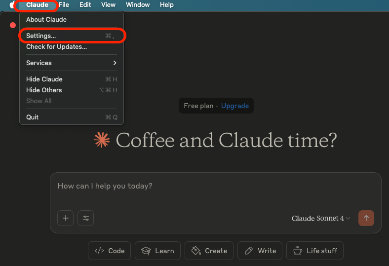
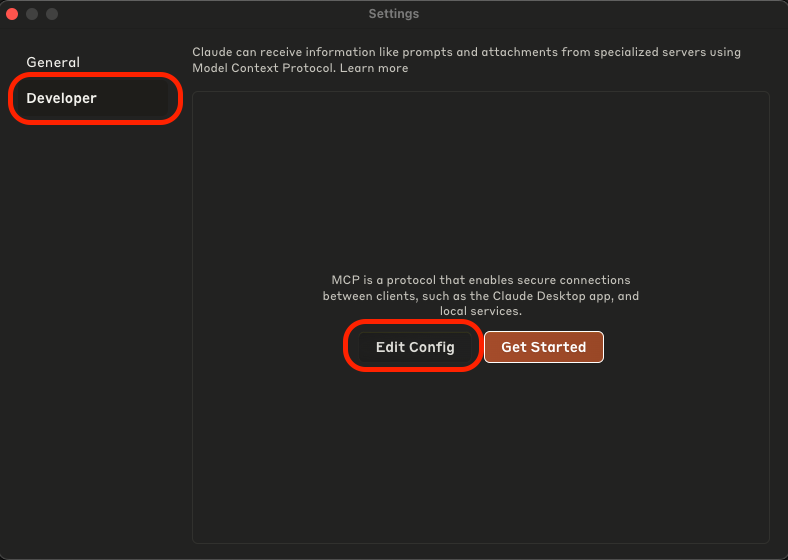
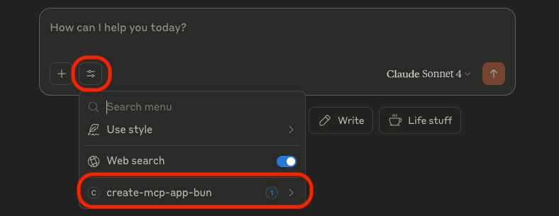
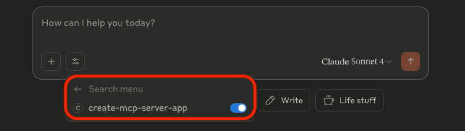
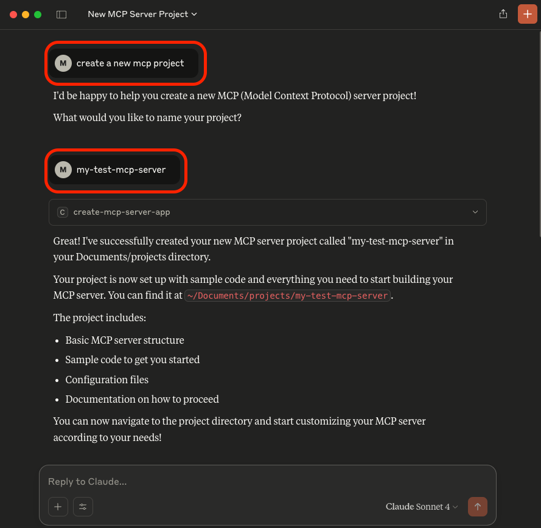

# MCP Server

MCP server providing functionality to set up your own MCP server project using Bun.

- [MCP Server](#mcp-server)
  - [Background](#background)
  - [Prerequisites](#prerequisites)
  - [Setup Project](#setup-project)
  - [Build](#build)
  - [Setup Claude Desktop](#setup-claude-desktop)
  - [Usage](#usage)
  - [Development](#development)
    - [New Tools](#new-tools)
    - [Test Coverage](#test-coverage)
      - [Prerequisites (Development)](#prerequisites-development)
      - [Running Test Coverage](#running-test-coverage)

## Background

This project utilizes Model Context Protocol (MCP) to facilitate a standardized tool (MCP server) to create a sample MCP project in a predefined location.

In this example, we are integrating with Claude Desktop to run the MCP server and at the same time act as MCP client to interact with the MCP server.

The sample project generated follows the same structure as this project with an example tool to calculate the sum of two numeric values.

The choice to use Bun instead of NodeJS was intentional to also showcase that Bun has made significant strides towards becoming a true alternative to NodeJS. It is lightning fast, easy to set up and comes with a lot of functionality out of the box. It also integrates well with existing tool chains, such as ESLint and others.

## Prerequisites

1. [Bun](https://bun.sh/docs/installation#installing) must be installed.
2. [Claude Desktop](https://claude.ai/download) should be installed.

## Setup Project

1. Clone the repository.
2. Run:

   ```sh
   bun install
   ```

3. Create a `.env` file in the root based on `/env/sample.env`. Provide values as necessary and described.

   **NOTE:** This is mostly relevant if you wish to run the server in development mode via `bun run start`.

4. _(Optional)_ Run the following to verify integrity of the project:

   ```sh
   bun run verify
   ```

## Build

1. Run:

   ```sh
   bun run build
   ```

This will bundle the entry `build/main.js`, which can then be consumed.

## Setup Claude Desktop

This section is influenced by this general [guide](https://modelcontextprotocol.io/quickstart/user) with specifics for this use case.

1. Start Claude Desktop and open Settings
   
2. Click on `Developer` in the left-hand bar of the Settings pane, and then click on `Edit Config`:
   
3. Edit the file `claude_desktop_config.json` and add the following:

   ```json
   {
     "mcpServers": {
       "create-mcp-app-bun": {
         "command": "bun",
         "args": ["run", "<path_to_project>/build/main.js"]
       }
     }
   }
   ```

   Replace <path_to_project> with the path to your project; e.g.: `/Users/username/Documents/projects/create-mcp-server-app-bun`

4. Restart Claude Desktop; this is important as Claude Desktop will otherwise not apply changes to `claude_desktop_config.json`.
5. On the main screen, click the `Search and Tools` button and then on your MCP server name:

   
   

Ensure that it is enabled.

## Usage

1. You can start by simply asking Claude to create a new MCP project: `create a new mcp project`

   Claude will in response ask you to specify a name (e.g. `my-test-mcp-server`), after which it creates the project.

   

2. The implementation will also handle situations correctly where the project already exists and prompt the user to specify the follow-up action.

## Development

### New Tools

New tools may be added by ensuring each new tool module in `./src/tools` extends `AbstractTool` and implements `ITool` and provides an explicit constructor (for test coverage):

```typescript
...
export class NewTool extends AbstractTool implements ITool {
  // Explicit constructor definition to ensure test coverage in Bun tracks constructor.
  constructor(fetch: typeof globalThis.fetch = globalThis.fetch) {
    super(fetch);
  }
...
```

Additionally, the following methods must be implemented (see their corresponding `JSDoc` for details.):

- `getName`
- `getDescription`
- `getInputSchema`
- `validateWithDefaults`
- `processToolWorkflow`

Use existing tool(s) as guide for the implementation and don't forget to implement a corresponding test.

There is no further configuration required to register any additional tool; they are automatically included upon restart of the MCP server.

### Test Coverage

It may be useful to analyze test coverage gaps using `lcov` reports, to gain better visibility into covered lines and functions.

**NOTES:**

- Constructors for classes should be defined in the respective class, as Bun only tracks a classes functions (including constructors). This is problematic when you inherit from an abstract class with its own constructor, which in turn is not tracked. Thus, simply define the Abstract constructor in the class and call `super`.
- Having some imports (e.g. `import dedent from "dedent";`) at the top of a module may cause Bun to not correctly track that line as covered. Simply move it behind other imports, and it will correctly track.

#### Prerequisites (Development)

1. Install `lcov`:

   ```sh
   brew install lcov
   ```

2. Install VSCode extension `ryanluker.vscode-coverage-gutters` (already defined in [settings.json](./.vscode/settings.json)).

#### Running Test Coverage

1. For most cases, it will suffice to run:

   ```sh
   bun run test:coverage
   ```

   **NOTE:** If the coverage is less than 100, but no `Uncovered Line #s` are reported, you may need to investigate further by following the next steps and revisiting the [Notes](#test-coverage) above.

2. For advanced cases, run:

   ```sh
   bun run test:coverage:lcov
   ```

   It produces the `lcov` [coverage report](./coverage/lcov.info) that is used by VSCode extension `ryanluker.vscode-coverage-gutters` to visualize covered lines in the editor.

3. If you prefer to have an HTML report, run in your terminal:

   ```sh
   genhtml --function-coverage --branch-coverage --output-directory coverage-report coverage/lcov.info
   ```

   It produces an HTML [coverage report](./coverage-report/index.html) that you can inspect in your preferred browser.
